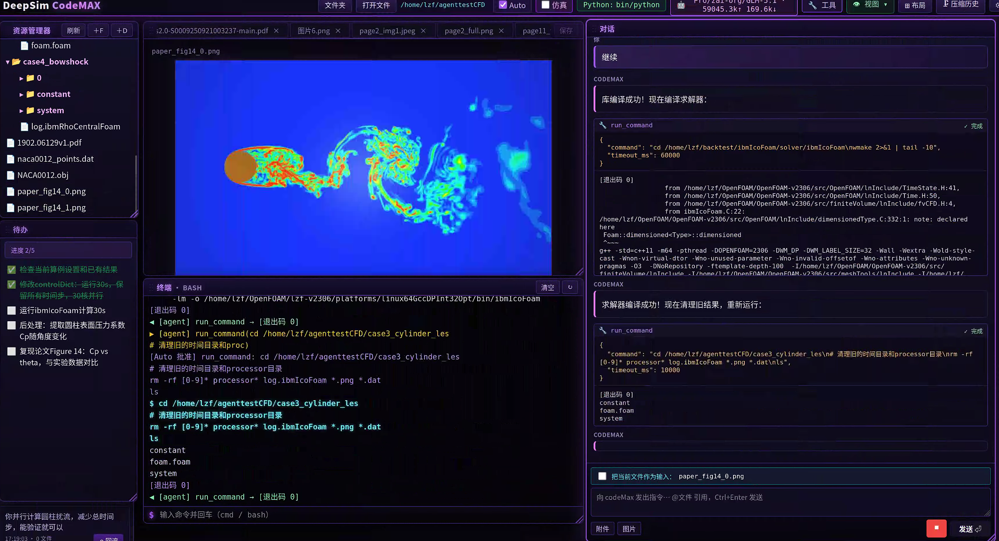

<div align="center">

# Null𝑭𝒍𝒖𝒙

**面向 CFD 与科学计算的中文智能体**
**用国产模型，打穿 OpenFOAM 工程任务 —— 数据不出本机，越用越懂你**
<sub>by **LZF** · 封装发行版 · Linux x64</sub>

[]()
[]()
[]()
[]()

</div>

---

<div align="center">
  
  <br>
  <sub>NullFlux 主界面：左侧资源管理器 / 中部 ParaView 渲染 + 终端 / 右侧多轮对话 + 工具调用卡片<br>（图为早期版本界面；当前 UI 已统一为 NullFlux 品牌，交互流程一致）</sub>
</div>

---

## 这是什么

**NullFlux** 是一个**本地部署、原生中文**的 AI Agent，专为 **CFD / 数值仿真 / 科学计算**场景设计。
它把一台 Linux 工作站变成一个会"自己动手"的助手：读论文、写代码、跑 OpenFOAM、调 ParaView、画图、改网格、解释残差曲线——全程对话驱动。

> 一句话：**ChatGPT 的多轮对话 × Cursor 的工具调用 × CFD 工程师的工作流**，全部跑在你自己的机器上。

---

## 为什么选 NullFlux —— 六大不可替代优势

### 一、国产模型即可打穿 Claude Code 在 CFD 场景的天花板

通用 Coding Agent（Claude Code / Cursor / Cline）面对 OpenFOAM、`controlDict`、`fvSchemes`、`snappyHexMeshDict`、残差日志这类**强领域知识**时，会反复试错、瞎改字典、误读 `Foam::error`。
NullFlux 把**CFD 工程师的工作流**直接编码到 System Prompt 与工具语义里，于是：

- **DeepSeek-V3 / Qwen3 / GLM-4.6 / Kimi-K2 等国产模型，在 CFD 任务上的成功率显著高于 Claude Code 调通用模型**
- 无需 $20/月订阅、无需翻墙、无需把你的算例上传到 Anthropic，**0.5 元能跑完 Claude Code 5 元才能完成的算例调试**
- API Key 直接对接 DeepSeek 官方 / 硅基流动 / 火山方舟 / 阿里百炼——开机就用，**断网也能接局域网 vLLM / Ollama**

### 二、为 OpenFOAM 深度优化

不是"能调 shell 就算支持 OpenFOAM"。NullFlux 内置：

- **专用工具 `openfoam_run` / `openfoam_log`**：自动 `source $FOAM_BASHRC`，环境变量隔离，避免污染主机 Python
- **字典感知**：知道 `system/`、`constant/`、`0/` 三大目录的含义，知道 `transportProperties` 该改哪一行
- **求解器图谱**：simpleFoam / pimpleFoam / interFoam / rhoCentralFoam / chtMultiRegionFoam …… 选错求解器会被立刻指出
- **网格工具链**：blockMesh → snappyHexMesh → checkMesh 一条龙，自动读 `log.*` 提取关键诊断
- **后处理直连 ParaView**：`pv_render` 调 `pvpython` 离屏渲染，残差曲线 / 流线 / 切面图直接贴回对话
- **可扩展到** SU2 / Fluent journal / CFX-Pre / 自研 CFD 求解器——只需补一个工具描述

### 三、越用越聪明 —— 项目记忆 (Project Memory)

通用 Agent 每次对话都是失忆症患者。NullFlux 不是。

- 每个工作目录维护**长期记忆库**：算例配置、踩过的坑、调参经验、成功的 BC 组合
- 第 N 次跑相似算例时，Agent **会先翻自己的笔记**："你上次在这个雷诺数下用 kOmegaSST 收敛慢，换成 kEpsilon + wallFunctions 之后好了"
- **你做的项目越多，它越懂你的研究方向**——这是订阅制 SaaS Agent 永远给不了的复利
- 记忆全部存本地，**不上云、不共享、纯私有资产**

### 四、真·本地化、真·可控

| 维度 | NullFlux | Claude Code / Cursor |
|---|---|---|
| 算例数据出境 | 不出本机 | 上传到美西服务器 |
| 离线运行 | 配本地 LLM 即可 | 必须连官网 |
| 工具调用审批 | 每步可视化授权 | 局部支持 |
| 工作目录沙箱 | 越界即拦截 | 全盘可写 |
| 商用合规 | 数据本地、源码封装 | 受出口管制 / 条款约束 |
| 成本 | 仅 LLM token 费用 | $20/月 起 + token |

### 五、一个二进制，零依赖部署

- **不需要 `npm install`**——所有第三方库已 bundle 进 `server.bundle.mjs`（~1.9 MB）
- **不需要 Docker / Kubernetes**——`./start.sh --port 5180` 一条命令起飞
- **不需要 GPU**——Agent 本体纯 CPU，GPU 留给你的 LLM 推理服务器
- 内网工作站 / HPC 登录节点 / 老服务器，**装个 Node 18 就能跑**

### 六、自动编译新算法 —— 不止"调参"，而是"造求解器"

这是 NullFlux 与一切通用 Coding Agent 的**根本分水岭**。

通用 Agent 只会改 `controlDict` 的几个数；NullFlux 会**给你写一个全新的求解器、自己 `wmake` 编译、装回 OpenFOAM、跑算例验证**。

- **自定义求解器 (`applications/solvers/`)**：从模板派生 → 改控制方程 → 加新项 → 写 `Make/files` 和 `Make/options` → `wmake libso` → 自动加进 `controlDict.application`
- **自定义边界条件 (`src/finiteVolume/.../BCs/`)**：继承 `fixedValueFvPatchField` → 实现 `updateCoeffs()` → 编译为动态库 → 在 `0/U` 里 `type myInletBC;` 一键启用
- **自定义湍流模型 / 物性 / 离散格式**：派生模板类 → 注册 `addToRunTimeSelectionTable` → 编译 → 在字典里 `RAS { model myKEpsilon; }`
- **自定义 utility / 后处理函数对象**：`postProcess -func myFieldCalc` 直接可用
- **编译失败自动诊断**：读 `wmake` 报错 → 定位到 `.C / .H` 行号 → 改 → 重编，循环直到通过
- **支持你自己研究领域的新算法**：TVD 限制器、AUSM+ 通量、压力修正变体、自适应时间步、IBM、LES SGS、燃烧反应、辐射……只要你说得清数学公式，它就能写成 C++ 编译进 OpenFOAM

> 一句话：**NullFlux 把"读论文 → 写代码 → 编译 → 调通 → 跑算例"五步压缩成一段对话。**
> 这是科研型 CFD 工作者真正需要的生产力，而不是又一个会写 Python 脚本的玩具。

---

## 它能做什么

### 智能体核心
- **OpenAI Function-Calling 风格**的工具循环：模型自主拆解任务、调用工具、读结果、修正、再调用，直到达成目标
- **多轮上下文自动压缩**（Auto-Compact）：长会话不爆 token，关键工具调用-响应配对绝不被切断
- **流式输出 + 中途打断**：随时按停，正在运行的进程会被干净地终止
- **多模型支持**：OpenAI / DeepSeek / 硅基流动 / 自定义 OpenAI-兼容端点，UI 一键切换

### 工具集（可视化授权 / 一键批准）
| 类别 | 工具 | 用途 |
|---|---|---|
| 文件 | `read_file` / `write_file` / `apply_patch` / `list_dir` | 读写工作目录、按行号或 diff 修改 |
| Shell | `run_shell` | 在受控沙箱中执行 bash 命令，输出实时回传 |
| Python | `run_python` / Notebook 内核 | 在持久 Jupyter 内核里执行，变量跨调用保留 |
| CFD | `openfoam_run` / `openfoam_log` | source bashrc → blockMesh / snappyHexMesh / 求解器一条龙 |
| 可视化 | `pv_render` | 调 `pvpython` 离屏渲染 vtk / foam → PNG，直接在对话里看 |
| 文档 | `doc_read` | PDF / DOCX / MD / 代码全文检索，定位到行 |
| 网络 | `web_fetch` | 抓网页（受白名单约束） |

### 安全与可控
- 工具调用前**前端弹审批**，可勾选"本会话内自动批准"
- 工作目录隔离，命令默认禁止越出
- 全程本地运行，**对话不上云**（除调用 LLM 本身的 API）
- 源码已经过 RC4 字符串加密 + 控制流扁平化 + Self-Defending 多重封装

### 前端
- 暗色玻璃拟态界面，**Markdown + KaTeX + Mermaid + 代码高亮**
- 工具调用以可折叠卡片展示，输入/输出一目了然
- 内嵌图片预览，Notebook 单元格直接渲染
- WebSocket 双向同步，多标签页共享会话状态

---

## 系统要求

| 项 | 最低 | 推荐 |
|---|---|---|
| OS | Linux x64 (glibc ≥ 2.28) | Ubuntu 22.04 / RHEL 9 |
| Node.js | 18.x | 20.x LTS |
| 内存 | 2 GB | 8 GB+ |
| 磁盘 | 200 MB | + 工作目录所需 |
| 可选 | Python 3.9+ · ParaView 5.x · OpenFOAM v2206+ | 都装上体验最佳 |

---

## 快速开始

```bash
# 1. 下载并解压
tar xzf nullflux-linux-sealed.tar.gz
cd nullflux-linux-sealed

# 2. 启动（默认端口 5174）
./start.sh

# 或指定端口（4 种写法任选）
./start.sh --port 5180
./start.sh -p 5180
./start.sh 5180
./start.sh --port 5180 --host 127.0.0.1
```

启动后浏览器打开 `http://<服务器IP>:<端口>`，点右上角 **⚙ 设置**：
1. 填 **LLM Provider + API Key**（或自定义 BaseURL）
2. 可选：填 **ParaView / OpenFOAM** 路径
3. 选择 **工作目录**（Agent 的所有文件操作都在这里）

完事，开聊。

---

## 部署到生产服务器

```bash
# 上传
scp nullflux-linux-sealed.tar.gz user@server:/opt/

# 在服务器上
ssh user@server
cd /opt && tar xzf nullflux-linux-sealed.tar.gz
cd nullflux-linux-sealed
./start.sh --port 5180 &
```

### systemd 托管（可选）

```ini
# /etc/systemd/system/nullflux.service
[Unit]
Description=NullFlux Agent
After=network.target

[Service]
Type=simple
User=nullflux
WorkingDirectory=/opt/nullflux-linux-sealed
ExecStart=/opt/nullflux-linux-sealed/start.sh --port 5180 --host 0.0.0.0
Restart=on-failure
RestartSec=5

[Install]
WantedBy=multi-user.target
```

```bash
sudo systemctl daemon-reload
sudo systemctl enable --now nullflux
sudo systemctl status nullflux
```

### Nginx 反向代理（可选）

```nginx
location /nullflux/ {
    proxy_pass http://127.0.0.1:5180/;
    proxy_http_version 1.1;
    proxy_set_header Upgrade $http_upgrade;
    proxy_set_header Connection "upgrade";
    proxy_set_header Host $host;
    proxy_read_timeout 86400;
}
```

---

## 目录结构

```
nullflux-linux-sealed/
├── server.bundle.mjs   ← 主程序（封装混淆，~1.9 MB，所有 npm 依赖已内联）
├── doc_reader.py       ← Python 辅助：文档解析
├── nb_kernel_host.py   ← Python 辅助：Notebook 内核
├── public/             ← 前端静态资源
├── start.sh            ← 启动脚本（支持端口参数）
└── README.md           ← 本文
```

> 封装版**不需要 `npm install`**，所有第三方依赖（express / ws / dotenv 等）已 bundle 进 `server.bundle.mjs`。

---

## 常见问题

<details>
<summary><b>端口被占用？</b></summary>

```bash
./start.sh --port 5181     # 换一个
# 或者查谁占了
ss -tlnp | grep 5180
```
</details>

<details>
<summary><b>需要外网访问？</b></summary>

`start.sh` 默认 `HOST=0.0.0.0`，已经监听所有网卡。检查防火墙：
```bash
sudo ufw allow 5180/tcp        # Ubuntu
sudo firewall-cmd --add-port=5180/tcp --permanent  # RHEL
```
</details>

<details>
<summary><b>ParaView 报 "No module named paraview"？</b></summary>

不要用系统 Python 跑 `pvpython`。在 ⚙ 设置里把 **pvpython 路径**指向 ParaView 自带的：
```
/opt/ParaView-5.12/bin/pvpython
```
NullFlux 会自动清掉宿主机的 `PYTHONHOME / PYTHONPATH`。
</details>

<details>
<summary><b>会话变慢 / token 用爆？</b></summary>

NullFlux 内置 Auto-Compact，达到阈值会自动压缩历史。也可以在对话框里点 **🗜 压缩**手动触发，或 **🗑 新会话**重开。
</details>

<details>
<summary><b>能不能离线跑（无外网）？</b></summary>

可以——只要你接的是**局域网内的 LLM 服务**（vLLM / Ollama / 本地 OpenAI-兼容端点）。NullFlux 本身完全离线运行，不会"打电话回家"。
</details>

---

## 升级 / 卸载

```bash
# 升级：直接替换目录
cd /opt && rm -rf nullflux-linux-sealed
tar xzf nullflux-linux-sealed.tar.gz
systemctl restart nullflux

# 卸载
systemctl disable --now nullflux
rm -rf /opt/nullflux-linux-sealed /etc/systemd/system/nullflux.service
```

设置（API Key 等）保存在用户主目录 `~/.nullflux/`，如需彻底清除一并删除该目录。

---

## 联系作者

- **作者**：LZF
- **邮箱**：[lizifeng@ipe.ac.cn](mailto:lizifeng@ipe.ac.cn)
- **机构**：中国科学院过程工程研究所 (IPE, CAS)

**欢迎商业合作与科研合作来信**，包括但不限于：

| 合作方向 | 说明 |
|---|---|
| 商业部署 / 授权 | 多节点 license、企业内私有模型对接、二次开发、定制功能 |
| 科研合作 | 高校 / 院所 CFD 课题联合攻关、论文复现、AI4Science |
| 新算法 / 新求解器定制 | 描述数学公式 + 应用场景，提供专属工具链与求解器封装 |
| 培训与演示 | 团队内训、CFD + AI Agent 工作坊 |

一般 Bug 反馈与使用咨询亦可通过邮箱联系，请附启动日志、模型名称与复现步骤。

---

## 许可

封装发行版仅供**评估、个人学习、内部部署**使用，**禁止反混淆、二次分发、商用转售**。
商业授权 / 技术合作请联系作者：**lizifeng@ipe.ac.cn**

---

<div align="center">

**Null𝑭𝒍𝒖𝒙** · *Flow the void, compute the rest.*
© 2026 **LZF** — All rights reserved.

</div>
